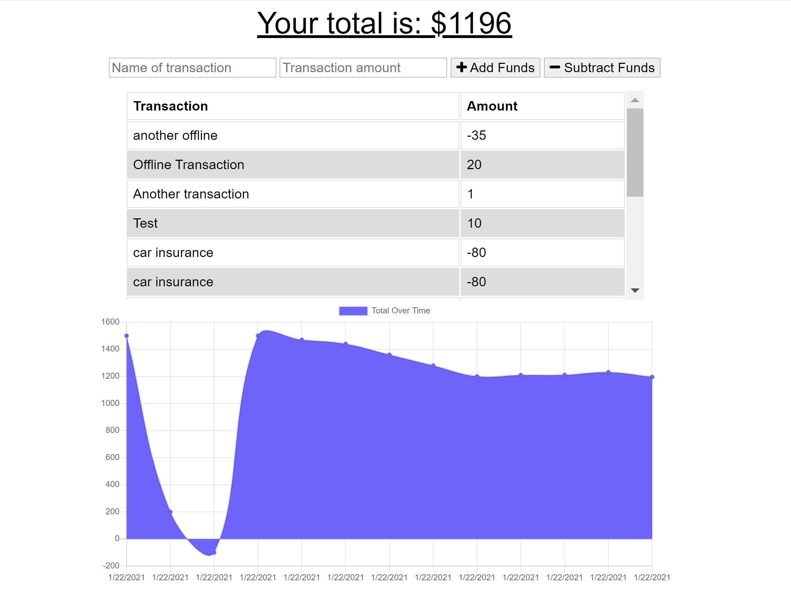

# Progressive_Web_APP_Budget_Tracker

* View the [Github Repo](https://github.com/girmaD/Progressive_Web_APP_Budget_Tracker)
* View the [Deployed Heroku link](https://whispering-earth-95595.herokuapp.com/)

## Description
  This application is a progressive web application (PWA). The app works both online and offline. It is also installable as a native app on any platfrom be it android, ios or desktop. For this to happen the app uses PWA technologies such as service-workers, manifest.json and index DB from a browser. If the user uses older brower that doesn't support PWA technologies, the app still works as a regulat web app.  With this app, a user can enter transactions (both deposit and expenses) with or without good internet connection. That capability makes it perform like a native app. The app displays all transactions in a table as well as in gragh.    

## Table Of Contents 
* [Installation Instructions](#Installation-Instructions)
* [How To Use The App](#How-To-Use-The-App)
* [Contributing Guidelines](#Contributing-Guidelines)
* [Test Information](#Test-Information)
* [License](#License)
* [Questions](#Questions)

## Installation Instructions

 * fork and use it.
 * Don't forget to install all the modules this app depends on.
 * npm i -> will install all the dependecies
 * Install it like a native app in your machine by clicking the + sign on the url bar on computer or clicking install all on your phone.

## How To Use The App
- If you fork it, launch the app on the terminal - using (npm start) or launch it on heroku using the provided heroku link.
- The app will display, all the transacton in table and graph. It also shows the total budger you have.
- Enter your deposit's name and amount and click Add Funds
- Enter your expenses's name and amount and click Subtract Funds

Here is a screen shot of the main page

## Contributing Guidelines
 * contact me on the email provided below

## Test Information
  * No test specified

## License

 * MIT

## Questions

Should you have any questions about this project,
  * you can reach me through email: [girma.derib@gmail.com](mailto:girma.derib@gmail.com) 
  * or visit my [Github Profile](https://github.com/girmaD) for more information.
